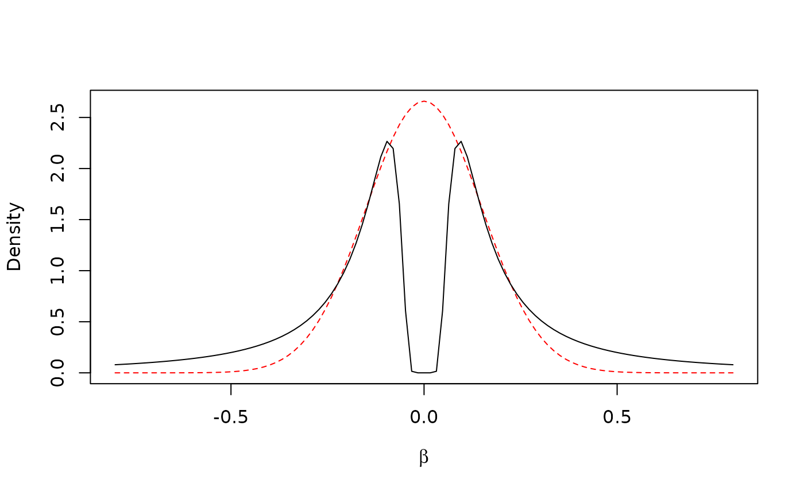

# Non-local priors

``` r


# load required package
library(finimom)
```

Non-local densities are a family of probability distributions with zero
density at the null parameter value. One of the members of this
probability distribution family is a product inverse-moment (piMOM)
prior for a parameter vector $`\boldsymbol{\beta} \in \mathbb{R}^d`$,
with density

``` math
f(\boldsymbol{\beta}|\tau, r) = \prod_{k = 1}^d\frac{\tau^{r/2}}{\Gamma(r/2)}|\beta_k|^{-(r+1)}\exp \left( -\frac{\tau}{\beta_k^2} \right),
```

with parameters $`\tau, r > 0`$. The parameter $`\tau`$ controls the
spread of the distribution away from the null value, and $`r`$ controls
the tail behaviour of the distribution (Johnson, Rossell 2012). Here, we
only consider the case of $`r = 1`$, which leads to Cauchy-like tails in
the distribution.

The choice of $`\tau`$ can be set such that
$`\mathbb{P}(|\beta| < q_\beta) = q`$. For genetic analyses, Sanyal et
al. (2019) suggested $`q_\beta = 0.05`$ and $`q = 0.01`$. We can obtain
the corresponding quantile from the relation of the inverse-moment prior
with the (inverse) Gamma distribution (Johnson, Rossell 2010):

``` r


betaq <- 0.05
q <- 0.01

qgamma(1 - q, shape = 0.5, scale = 1)*betaq^2
#> [1] 0.008293621
```

The marginal density with $`\tau = 0.0083`$ is reminiscent of the
Gaussian distribution with $`\sigma^2 = 0.15`$, suggested by Wakefield
(2017) and commonly used as the prior for genetic effects
(e.g. Giambartolomei et al. 2014):

``` r


curve(dnorm(x, 0, 0.15), -0.8, 0.8,
      col = "red", lty = 2, 
      xlab = bquote(beta), ylab = "Density")
curve(dimom(x, tau = 0.0083, r = 1), lty = 1, add = T)
```



The key differences between the two distributions are that (i) the
non-local prior density approaches 0 when $`|\beta| \rightarrow 0`$, and
(ii) the tails of the non-local density are thicker. Due to (i),
non-local priors apply a strong penalty when any of its components are
close to zero, therefore making them suitable for variable selection. As
for (ii), the Cauchy-like tails protect from over-shrinkage of true
large effects.

Note that the above example with $`\tau = 0.0083`$ is for illustrative
purposes only – it is recommended to let $`\tau`$ be estimated based on
the data (please see Karhunen et al. (2023) for details).

## References

Giambartolomei et al. (2014). Bayesian Test for Colocalisation between
Pairs of Genetic Association Studies Using Summary Statistics. *PLoS
Genet*.

Johnson, Rossell (2010). On the use of non-local prior densities in
Bayesian hypothesis tests. *J. R. Statist. Soc. B*.

Johnson, Rossell (2012). Bayesian Model Selection in High-Dimensional
Settings. *J Am Stat Assoc*.

Karhunen et al. (2023). Genetic fine-mapping from summary data using a
nonlocal prior improves the detection of multiple causal variants.
*Bioinformatics*.

Sanyal et al. (2019). GWASinlps: non-local prior based iterative SNP
selection tool for genome-wide association studies. *Bioinformatics*.

Wakefield (2009). Bayes factors for genome-wide association studies:
comparison with P-values. *Genet Epidemiol*.

## Session information

``` r


sessionInfo()
#> R version 4.6.1 (2026-06-24)
#> Platform: x86_64-pc-linux-gnu
#> Running under: Ubuntu 24.04.4 LTS
#> 
#> Matrix products: default
#> BLAS:   /usr/lib/x86_64-linux-gnu/openblas-pthread/libblas.so.3 
#> LAPACK: /usr/lib/x86_64-linux-gnu/openblas-pthread/libopenblasp-r0.3.26.so;  LAPACK version 3.12.0
#> 
#> locale:
#>  [1] LC_CTYPE=C.UTF-8       LC_NUMERIC=C           LC_TIME=C.UTF-8       
#>  [4] LC_COLLATE=C.UTF-8     LC_MONETARY=C.UTF-8    LC_MESSAGES=C.UTF-8   
#>  [7] LC_PAPER=C.UTF-8       LC_NAME=C              LC_ADDRESS=C          
#> [10] LC_TELEPHONE=C         LC_MEASUREMENT=C.UTF-8 LC_IDENTIFICATION=C   
#> 
#> time zone: UTC
#> tzcode source: system (glibc)
#> 
#> attached base packages:
#> [1] stats     graphics  grDevices utils     datasets  methods   base     
#> 
#> other attached packages:
#> [1] finimom_0.3.0
#> 
#> loaded via a namespace (and not attached):
#>  [1] digest_0.6.39     desc_1.4.3        R6_2.6.1          fastmap_1.2.0    
#>  [5] xfun_0.60         cachem_1.1.0      knitr_1.51        htmltools_0.5.9  
#>  [9] rmarkdown_2.31    lifecycle_1.0.5   cli_3.6.6         sass_0.4.10      
#> [13] pkgdown_2.2.1     textshaping_1.0.5 jquerylib_0.1.4   systemfonts_1.3.2
#> [17] compiler_4.6.1    tools_4.6.1       ragg_1.5.2        bslib_0.11.0     
#> [21] evaluate_1.0.5    Rcpp_1.1.2        yaml_2.3.12       otel_0.2.0       
#> [25] jsonlite_2.0.0    rlang_1.3.0       fs_2.1.0
```
